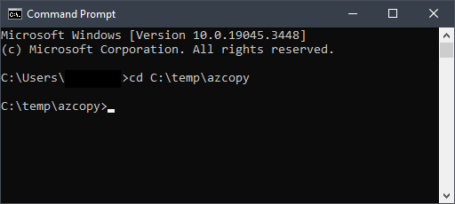
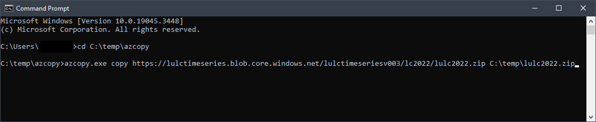

# Download LULC Data using AzCopy

This guide will walk you through the process of downloading the Land Use and Land Cover (LULC) dataset using AzCopy, a command-line tool for Azure Storage.

## Prerequisites

Before you begin, ensure you have the following prerequisites in place:

- [AzCopy](https://learn.microsoft.com/en-us/azure/storage/common/storage-use-azcopy-v10): Download the appropriate version of AzCopy from the official Microsoft website. AzCopy V10 is a standalone executable file and doesn't require installation.

## Download Procedure

1. **Download AzCopy:**

    First, download the AzCopy tool from the official Microsoft website. AzCopy is available as a standalone executable, so there's no need for an installation process.

2. **Unzip AzCopy:**

    Extract the downloaded AzCopy executable to a location of your choice. For instance, you can unzip it to a temporary folder on your C drive.

3. **Open Command Line Interface:**

    Open a command-line interface of your choice (e.g., Command Prompt or PowerShell) and navigate to the directory containing the `azcopy.exe` executable.

    ```bash
    cd C:\path\to\azcopy
    ```

    

4. **Copy LULC 2022 Data:**

    Use the following command to copy the LULC 2022 data from the Azure Storage account to your local directory. Replace `C:\temp\lulc2022.zip` with the path where you want to store the downloaded data.

    ```bash
    azcopy.exe copy https://lulctimeseries.blob.core.windows.net/lulctimeseriesv003/lc2022/lulc2022.zip C:\temp\lulc2022.zip
    ```

    

That's it! You've successfully downloaded the LULC 2022 data using AzCopy.

For any issues or further assistance, please refer to the official AzCopy documentation or reach out to our support team.